# ShtiCell - A Multi-User Spreadsheet System
As part of a Java Development course, I independently built a spreadsheet management application using JavaFX.

The system enables each cell to store static values, reference other cells, or derive its value from complex function compositions. It supports function composition, allowing cells to compute values based on multiple functions applied across different cells, enabling advanced relationships and calculations.

This application runs with a server in the background using Tomcat. For this project, I utilized several libraries, including JavaFX, OkHttp, Gson, and more.

## Login
Log in to your account here.

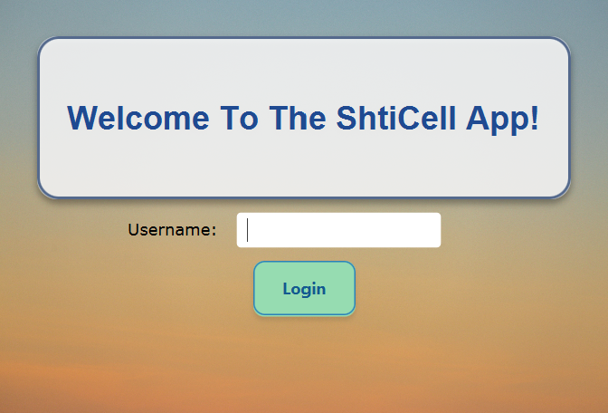

## Dashboard
This page provides an overview of all the sheets in the system and shows the current permissions assigned to different users.

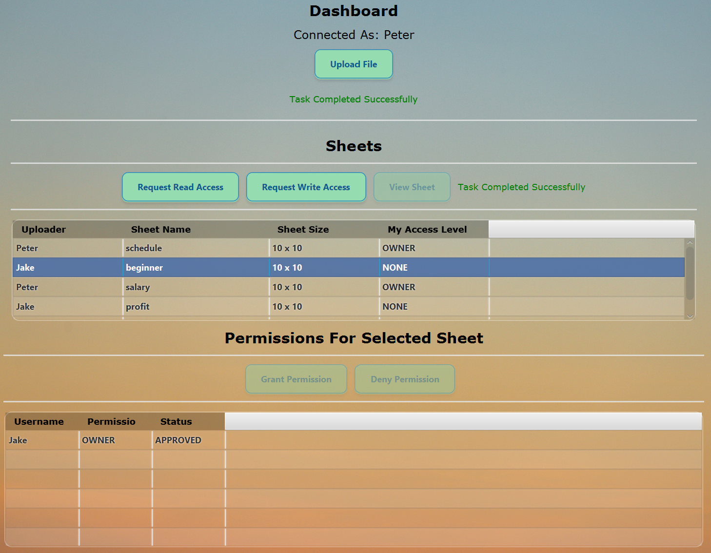

## User Permissions
When user doesn't have permission, he can request read/write permissions and wait for the owner to approve/decline.

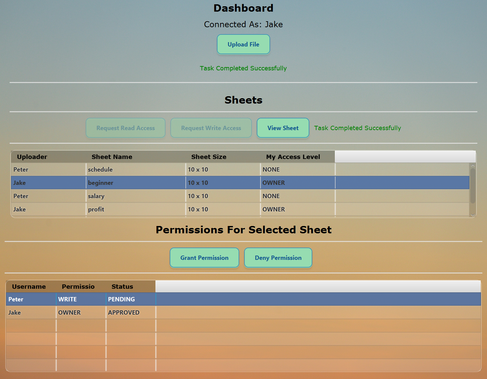

After that - the change takes effect.

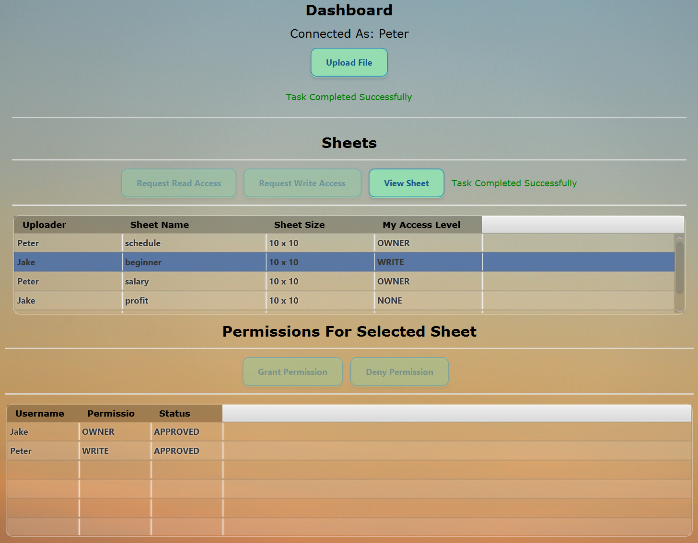

## Sheet View
Here, you can view and make changes to the selected sheet (if you have write access; otherwise, you can only view it).

## Range Functions
A range is a sub-table with functions that can be applied to all its elements. Available functions include average and sum.

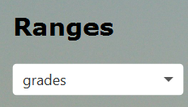

After selection:

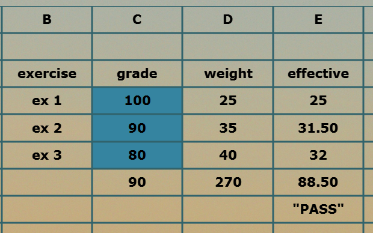

## Multiple-Function Use (Function Composition)
Cells can be outputs of other cells, which in turn may result from functions, and so on. A mechanism to prevent circular references is implemented.

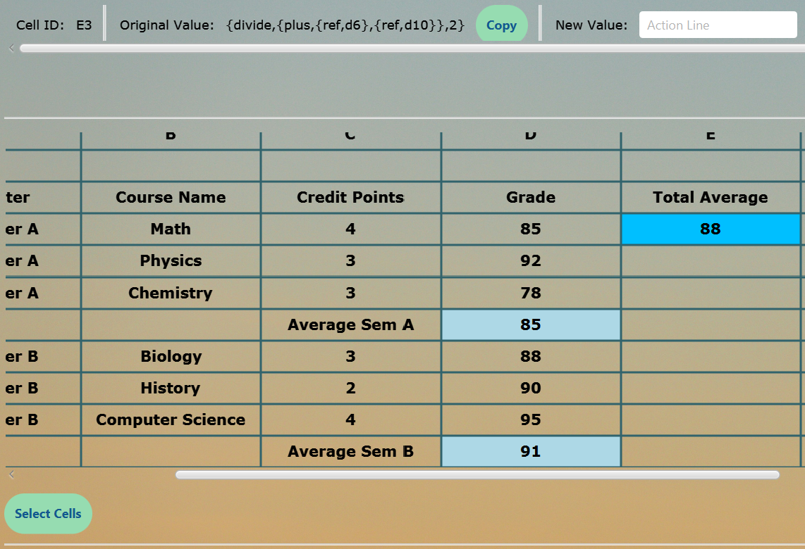

## Selection a sub-table

To use features like sorting and filtering, the user must select a sub table that will be applied.

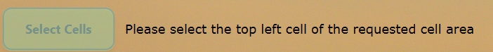

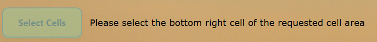

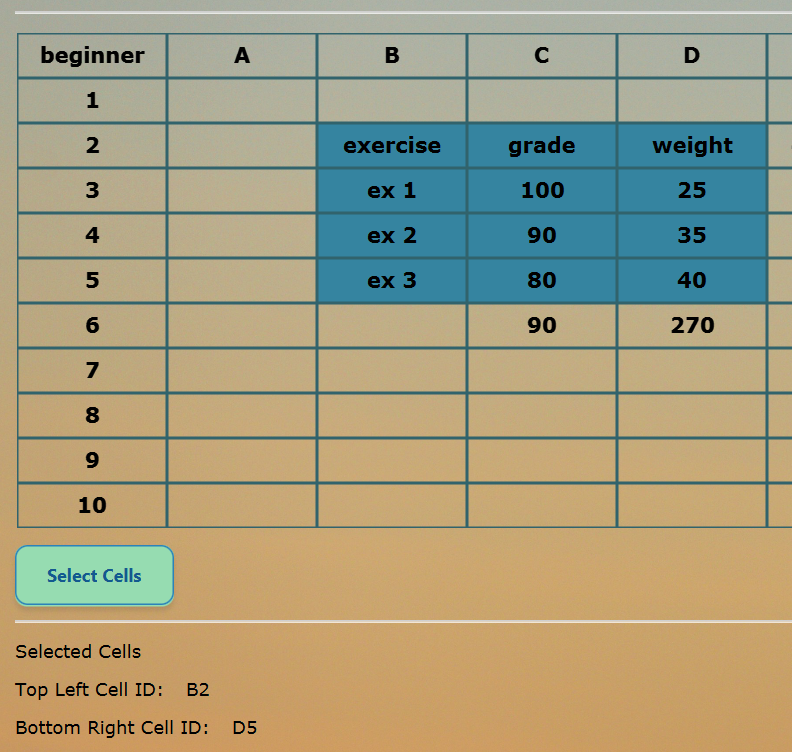

After selection, the corresponding options in the commands menu will be available:

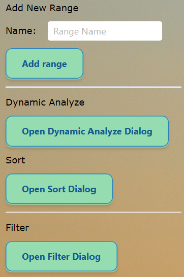

## Sorting Feature
Ranges (sub-tables) can be sorted by one or more columns (with the option to choose the order of the columns).

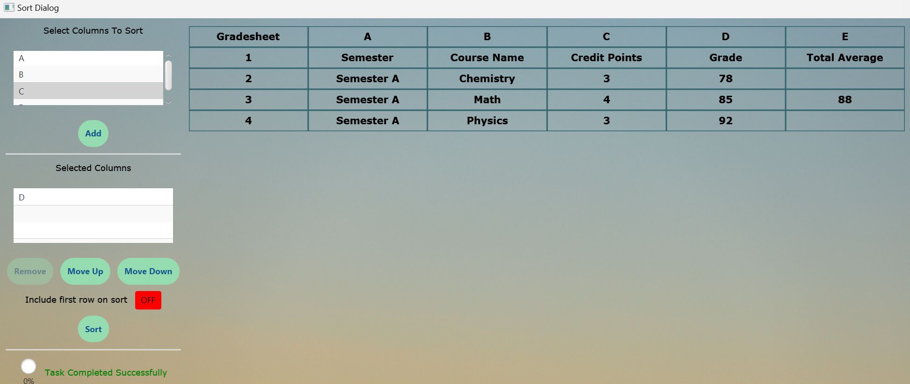

There's also an option to filter rows based on specific column values (showing only rows with your chosen values).

## Dynamic Analyze
This feature allows you to select a specific cell and define a maximum, minimum, and step. A slider appears, and as you drag it, the value of the cell changes while the table dynamically reflects the updated values.

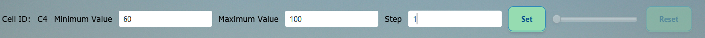

Visualization:

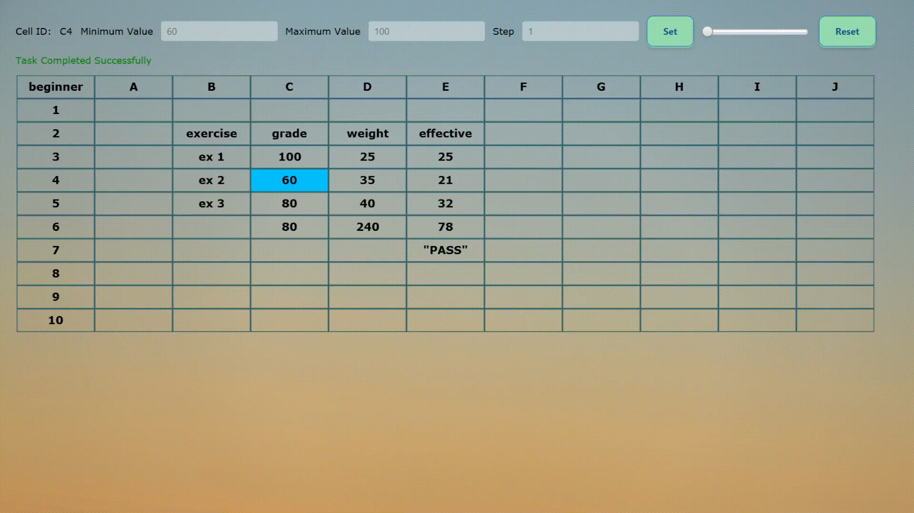

## Versions and Auto Update
Each sheet maintains a version history, which can be accessed from the version chooser.

When multiple users are editing the same sheet, any changes made by one user will trigger a blinking message for the others, notifying them of a new version. To make further changes, users must sync first.

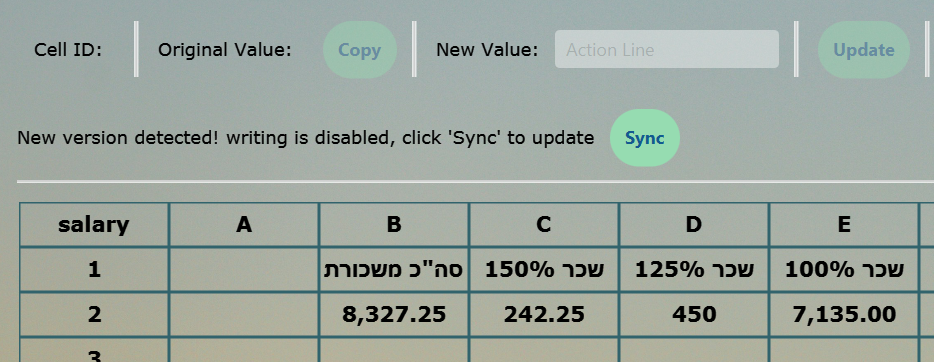

## Styling
A side bar offers options for customizing the sheet with animations, different styles, column/row scaling, and changing cell colors and fonts.

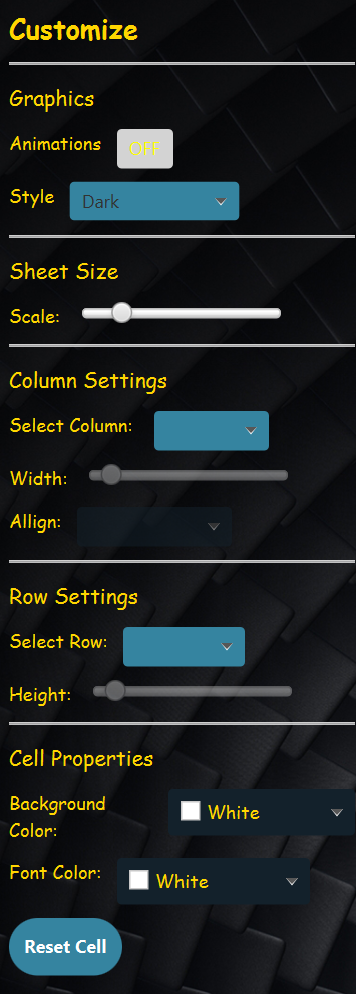

The Sheet View window in Dark Mode.

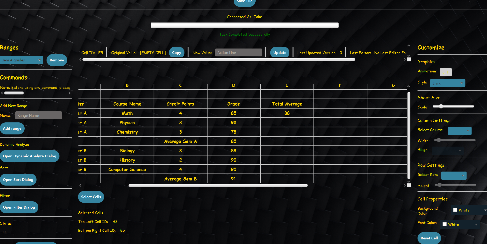

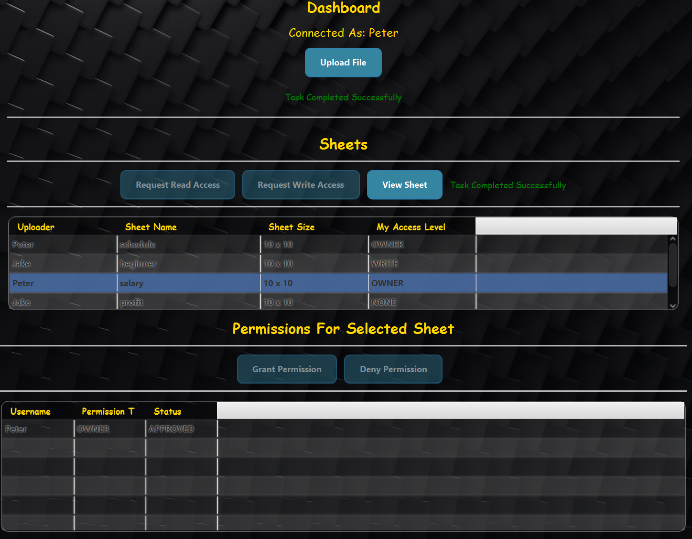

