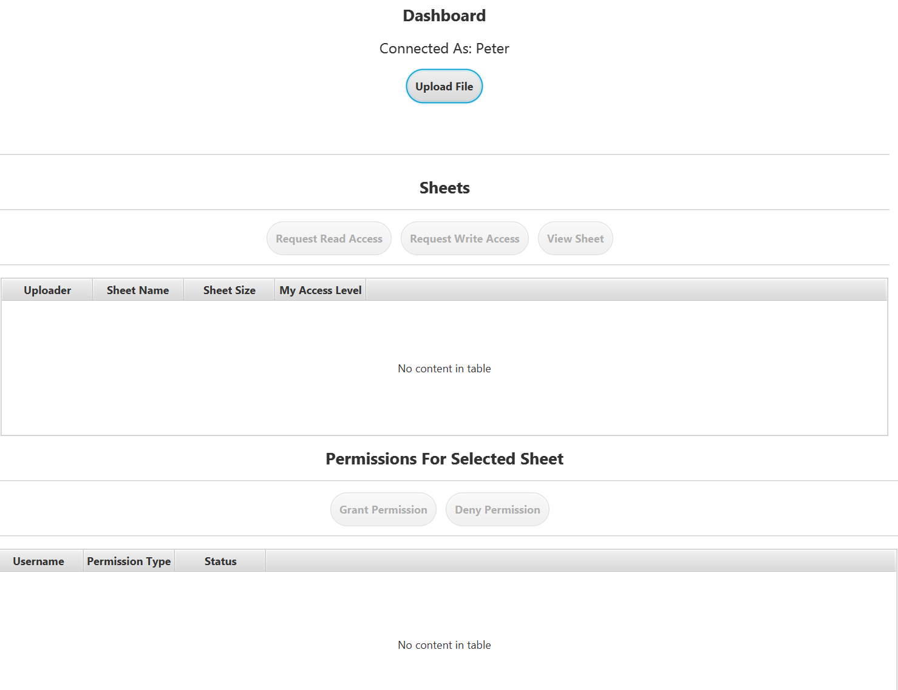
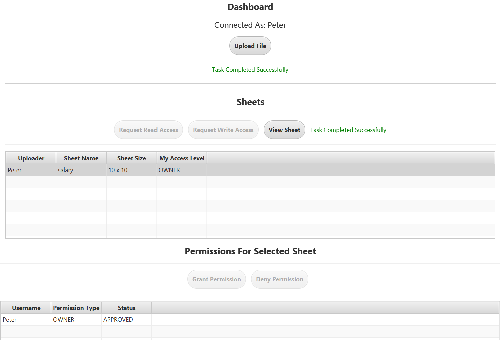
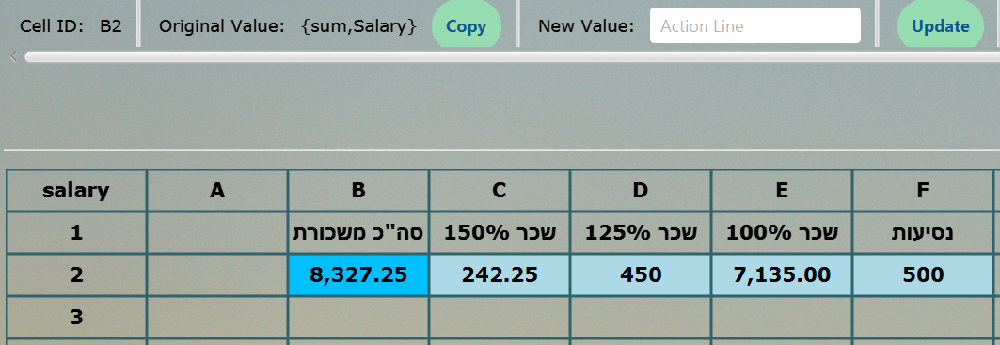
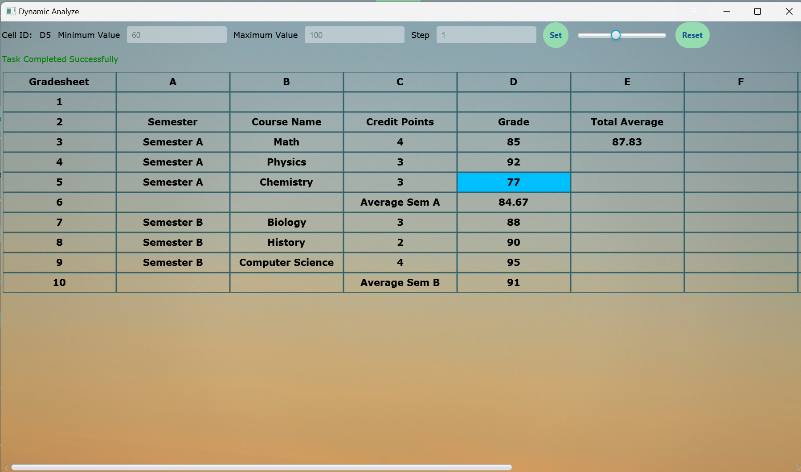
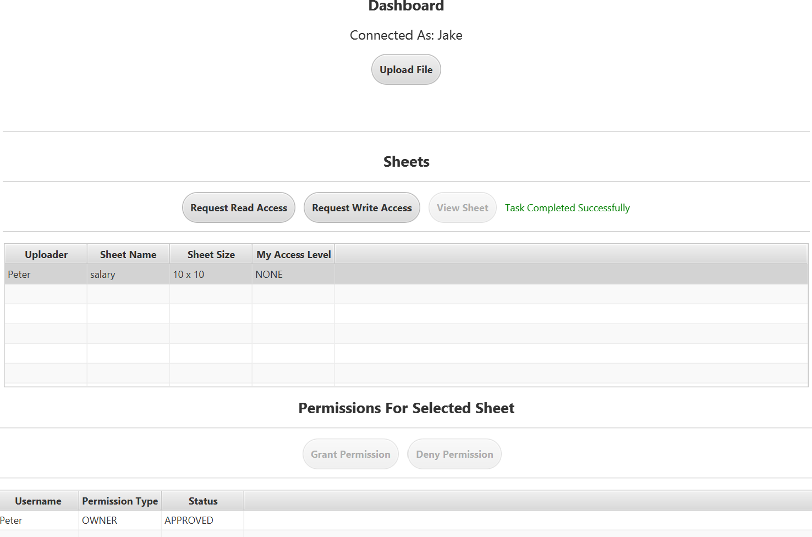
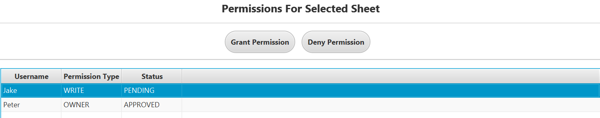

ShtiCell - A Multi-User Spreadsheet System
As part of a Java Development course, I independently developed an application for managing spreadsheets. The system allows each cell to hold static values, reference other cells, or result from complex function compositions. It supports function composition, enabling cells to derive values from multiple functions applied across different cells, facilitating intricate relationships and calculations.

Login
Log in to your account here.

Dashboard
This page provides an overview of all the sheets in the system and shows the current permissions assigned to different users.

After selecting a sheet, you can opt to view it (if you have the necessary permissions).

Sheet View
Here, you can view and make changes to the selected sheet (if you have write access; otherwise, you can only view it).

Range Functions
A range is a sub-table with functions that can be applied to all its elements. Available functions include average and sum.

Multiple-Function Use (Function Composition)
Cells can be outputs of other cells, which in turn may result from functions, and so on. A mechanism to prevent circular references is implemented.

Sorting Feature
Ranges (sub-tables) can be sorted by one or more columns (with the option to choose the order of the columns).

There's also an option to filter rows based on specific column values (showing only rows with your chosen values).
Dynamic Analyze
This feature allows you to select a specific cell and define a maximum, minimum, and step. A slider appears, and as you drag it, the value of the cell changes while the table dynamically reflects the updated values.

User Permissions
Users can view sheets and request read and/or write permissions.

Only the owner can approve or deny these requests.

Versions and Auto Update
Each sheet maintains a version history, which can be accessed from the version chooser.

When multiple users are editing the same sheet, any changes made by one user will trigger a blinking message for the others, notifying them of a new version. To make further changes, users must sync first.

Styling
A side bar offers options for customizing the sheet with animations, different styles, column/row scaling, and changing cell colors and fonts.

The Sheet View window in Dark Mode.

